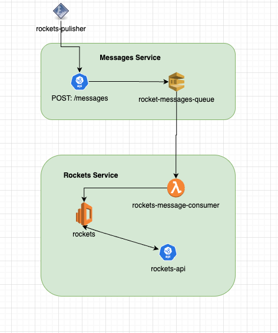
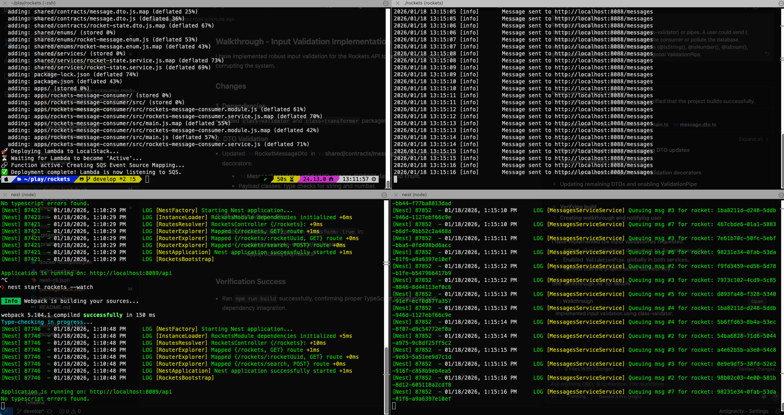
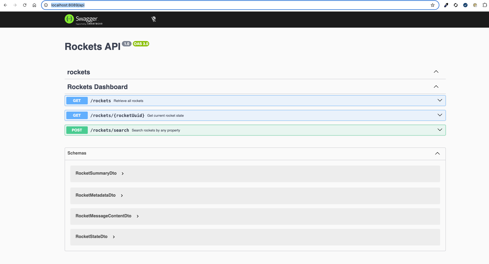
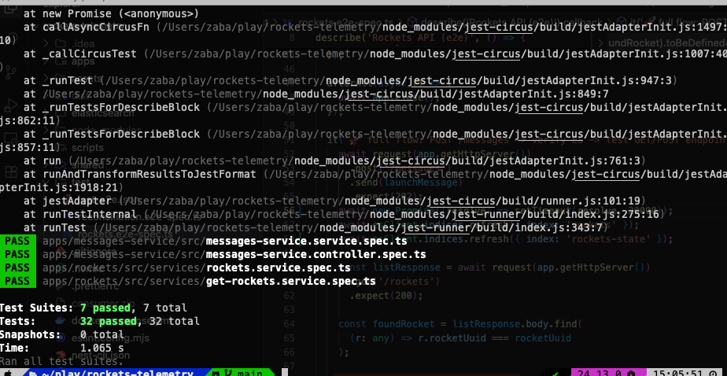
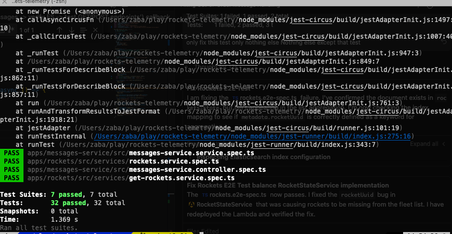
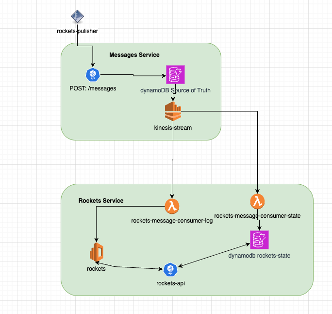

# 🪐 Rockets 🚀

This system is designed to consume real-time telemetry from multiple rockets, process state changes (speed updates, mission changes, explosions), 
and provide a clean REST API for a monitoring dashboard.


# Architecture

Below is an architecture that i thought will fit with my prioritization within 6 hours

[A better architecture is mentioned here](#a-better-architecture)



The solution is built as a NestJS Monorepo, utilizing an event-driven architecture to handle high-volume telemetry data with eventual consistency.

## Ingestion API (messages-service) 
Receives high-frequency POST requests from rockets and queues them in Amazon SQS (via LocalStack).

## Message Consumer (rockets-message-consumer)
A function that consumes SQS messages. It stores the messages keeping the (at-least once) in mind

## Dashboard API (rockets)
Provides REST endpoints to query the latest state and perform complex searches across the fleet.

## Storage (Elasticsearch)
Used for high-speed indexing and aggregations.

# Getting Started
This section demos how to run the solution in Dev Env. Apologies for not having a production build did not fit within the 6 hour limit


## Prerequisites
* Node.js (v20+) ~ tested on 24.13.0
* Docker & Docker Compose
* The rockets test executable
* awscli-local
* @nestjs/cli _optional_

### Installations

```shell
npm install
```

```shell
# Optional
npm install -g @nestjs/cli
```

```shell
pip install awscli-local
```

### Environment Variables

```shell
export AWS_ACCESS_KEY_ID=test
export AWS_SECRET_ACCESS_KEY=test
export AWS_DEFAULT_REGION=us-east-1
```

### Running the services

```shell
npm run start rockets --watch
```

```shell
npm run start messages-service --watch
```

```shell
npm run infra:up
```

### Processing the data

```shell
./rockets launch "http://localhost:8088/messages" --message-delay=500ms --concurrency-level=1
```

At this point you will start processing the messages

your terminal can look like


### API Endpoints ~ Swagger

Now you can go to [Swagger](http://localhost:8089/api)



### Accessing the data in Elasticsearch ~ Kibana

You can also access kibana rockets [indice here](http://localhost:5601/app/elasticsearch/index_management/indices)


### Lambda Logs
You can view the lambda logs using the command below

```shell
docker compose logs -f localstack | grep -E "lambda|rockets-message-consumer"
```

# Testing

## Unit Tests

```shell
npm run test
```


## E2E Tests

```shell
npm run test:e2e
```



# Key Technical Considerations

## Out-of-Order Messages
The system uses `messageNumber` and `rocketUuid` within the Stateful Indexing logic to ensure that late-arriving messages do not overwrite newer data.

## Search Performance
The POST /search endpoint utilizes the searchByProperty method to perform efficient document filtering via bool.must queries and deterministic sorting, 
ensuring specific telemetry data is retrieved without manual client-side processing

# A better Architecture

The services in this project are slightly tightly coupled as there is a single sqs in the `messages-service`
so better arch will be 



This allows

1. Decouple the services
2. Easy addition of downstream systems
3. Use the default behaviour of dynamodb to deduplicate events
4. Event replay will be easier
5. Avoid the split-brain scenarios that can happen in elasticsearch


# Limitations
* There is no way to re-drive messages as no `dlq` was setup
* Given the amount of data in a production env i will vote to using kinesis for streaming instead of sqs

# Known Issues
* There is a hard limit of `size: 1000` set on the elastic search queries which can be resolved with either [Composite Aggregation](https://www.elastic.co/docs/reference/aggregations/search-aggregations-bucket-composite-aggregation) or normal pagination using the `search_after`  
